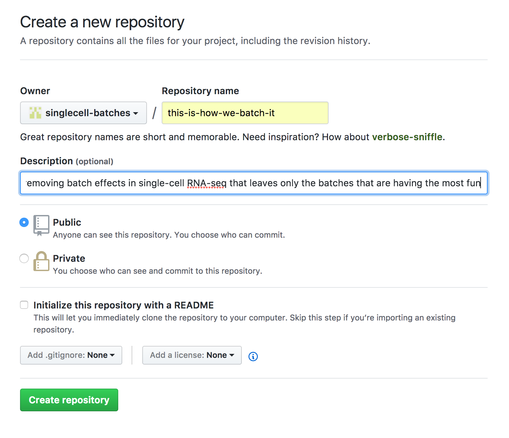
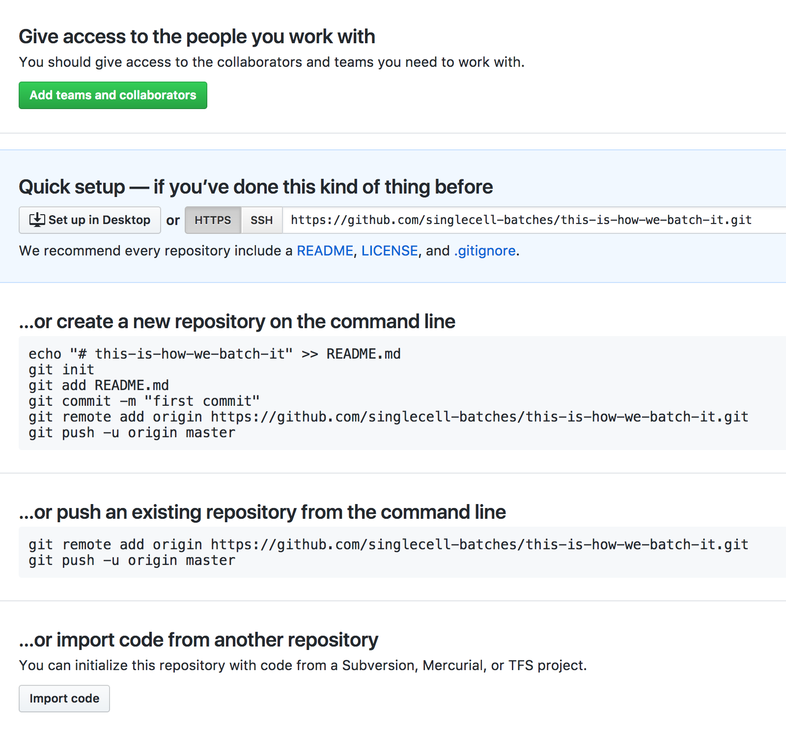
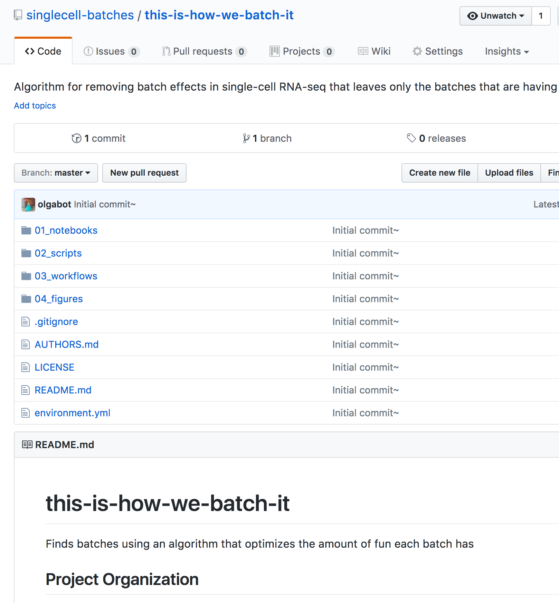

Reproducible Science
====================

[TOC]: # "Table of Contents"

# Table of Contents
- [Requirements](#requirements)
    - [Advanced installation](#advanced-installation)
- [Usage - Adding a batch effect correction algorithm](#usage---adding-a-batch-effect-correction-algorithm)
    - [Folder Structure](#folder-structure)
- [Adding the folder to GitHub](#adding-the-folder-to-github)
- [License](#license)


A boilerplate for reproducible and transparent science with close resemblances to the philosophy of [Cookiecutter Data Science](https://github.com/drivendata/cookiecutter-data-science): *A logical, reasonably standardized, but flexible algorithm structure for doing and sharing data science work.*

For reference,
[here](https://gist.github.com/olgabot/e25d4f4511bb499207b3e5051d0a0930) is an
example terminal output for installing `cookiecutter`, running the
`cookiecutter` command using this template, and pushing the folder to GitHub.

Requirements
------------
Install `cookiecutter` command line: `pip install cookiecutter`


### Advanced installation
If you want to use environments in `conda`, do:


```
conda create -n cookiecutter -c conda-forge python cookiecutter 
```


Which will produce the output:

```
Fetching package metadata ...............
Solving package specifications: .

Package plan for installation in environment /Users/olgabot/anaconda3/envs/cookiecutter:

The following NEW packages will be INSTALLED:

    arrow:           0.10.0-py36_0 conda-forge
    binaryornot:     0.4.3-py36_2  conda-forge
    chardet:         3.0.4-py36_0             
    click:           6.7-py36_0               
    cookiecutter:    1.5.1-py36_0  conda-forge
    future:          0.16.0-py36_1            
    jinja2:          2.9.6-py36_0             
    jinja2-time:     0.2.0-py36_1  conda-forge
    markupsafe:      0.23-py36_2              
    openssl:         1.0.2l-0                 
    pip:             9.0.1-py36_1             
    poyo:            0.4.1-py36_0  conda-forge
    python:          3.6.2-0                  
    python-dateutil: 2.6.1-py36_0             
    readline:        6.2-2                    
    setuptools:      27.2.0-py36_0            
    six:             1.10.0-py36_0            
    sqlite:          3.13.0-0                 
    tk:              8.5.18-0                 
    wheel:           0.29.0-py36_0            
    whichcraft:      0.4.1-py36_0  conda-forge
    xz:              5.2.2-1                  
    zlib:            1.2.8-3                  

chardet-3.0.4- 100% |##########################################################################################| Time: 0:00:00   3.60 MB/s
future-0.16.0- 100% |##########################################################################################| Time: 0:00:00   6.56 MB/s
poyo-0.4.1-py3 100% |##########################################################################################| Time: 0:00:00 203.05 kB/s
whichcraft-0.4 100% |##########################################################################################| Time: 0:00:00   8.13 MB/s
binaryornot-0. 100% |##########################################################################################| Time: 0:00:00  11.32 MB/s
arrow-0.10.0-p 100% |##########################################################################################| Time: 0:00:00 404.87 kB/s
jinja2-time-0. 100% |##########################################################################################| Time: 0:00:00   3.31 MB/s
cookiecutter-1 100% |##########################################################################################| Time: 0:00:00 310.38 kB/s
#
# To activate this environment, use:
# > source activate cookiecutter
#
# To deactivate an active environment, use:
# > source deactivate
#
```

If you used this route, you'll need to activate the environment:

```
source activate cookiecutter
```

## Usage - Adding a batch effect correction algorithm

 To start a new science algorithm, first change to your
`singlecell-batches` directory, which should be in `~/code`:

```
cd ~/code/singlecell-batches
```

From here, run the `cookiecutter` command using this template:

```
cookiecutter https://github.com/singlecell-batches/cookiecutter-reproducible-science
```

This proceeds to ask you some questions, for which you type in the answers and
press ENTER to get the next one. The text in brackets indicates the default
values, and the text after the colon indicates my answers, which are not default.

```
full_name [Brian Singlecell]: Olga Botvinnik
email [brian.singlecell@gmail.com]: olga.botvinnik@czbiohub.org
github_username [b-singlecell]: olgabot
algorithm_name [Name of your batch effect correction algorithm]: I got 99 batches
algorithm_slug [i-got-99-batches]: 
algorithm_short_description [A short description of your algorithm]: Finds up to 99 batches in your single-cell RNA-seq data
release_date [2017-08-09]: 
version [0.1.0]: 
```

```
```


If you've run this before, you may get the following question, which it is
totally okay to say "yes" to:

```
You've cloned /Users/olgabot/.cookiecutters/cookiecutter-reproducible-science before. Is it okay to delete and re-clone it? [yes]: yes
```

### Folder Structure

The directories for each algorithm comparison are

```
.
├── 00_data
├── 01_notebooks
├── 02_scripts
├── 03_workflows
├── 04_figures
├── AUTHORS.md
├── LICENSE
├── README.md
└── environment.yml
```
Here is a graphical overview of how the data flows between the folders.


Below is a more detailed description of each file/folder

- `00_data` - Input and output data for the project. By default, all files and
  folders here will be ignored by Git because they will tend to be big. If you
  **really** want to include something and its less than 100MB, you can use
  `git add -f data/000_notebookname/filename.csv` to add.
- `01_noteboboks` - All exploratory analyses in the form of Jupyter notebooks.
  Should be named in the order that you did them, e.g.

    ```
    000_combine_data.ipynb
    001_histograms_of_counts.ipynb
    002_combat_test_parameters.ipynb
    ```
- `02_scripts` - Once you've figured out what code you want to write for your
  data, you'll probably have a few standalone R/Python files that you'll want
  to run on your own. e.g.
    ```
    run_combat.py
    measure_before_after_distances.py
    ```
- `03_workflows` - As you figure what you want to compare, you'll probably have
  a common set of scripts from `02_scripts` that you want to run. These
  workflows can reference those scripts and produce outputs into `04_figures`

    ```
    combat_workflow.cwl
    ```
- `04_figures` - PNG or PDF images with graphs produced by either
  `01_notebooks`, `02_scripts` or `03_workflows`, named by the thing that
  produced them, e.g.

    ```
    001_histograms_of_counts/counts.pdf
    001_histograms_of_counts/counts_logged.pdf
    combat_workflow/initial_data/counts.pdf
    combat_workflow/corrected_data/counts.pdf
    run_combat/pca_before.pdf
    run_combat/pca_after.pdf
    ```
- `environment.yml` - Initially empty, but eventually should soon contain the
  installation dependencies for your algorithm. Can be created using `conda env
  export > environment.yml`. The idea is that anyone should be able to
  reproduce your analyses, using your exact packages.

Adding the folder to GitHub
---------------------------

Now that you've created the folder, it's time to add it to GitHub! Follow these
steps below to add your repository.

1. Go to github.com and log in
2. Click the plus sign ("+") next to your name and choose "New repository"
3. Create a repository under `singlecell-batches`, with the "slug" (folder
   name) created by `cookiecutter`. Use the same description as from
   `cookiecutter`. Once you're ready, press "Create repository"
   
4. You've now added a new, empty repository on GitHub! GitHub is now going to
   be helpful and give you some suggestions on what you should do next, but our
   instructions will be slightly different. Your screen should look like this:
   
5. Back to your terminal, you first want to initialize the repository with the
   command `git init`:
    ```
    (cookiecutter) ➜  this-is-how-we-batch-it git init
    Initialized empty Git repository in /Users/olgabot/code/singlecell-batches/this-is-how-we-batch-it/.git/
    ```
6. You can check how it worked by using `git status`
    ```
    (cookiecutter) ➜  this-is-how-we-batch-it git:(master) git status
    On branch master
    
    Initial commit
    
    Untracked files:
      (use "git add <file>..." to include in what will be committed)
    
        .gitignore
        01_notebooks/
        02_scripts/
        03_workflows/
        04_figures/
        AUTHORS.md
        LICENSE
        README.md
        environment.yml
    
    nothing added to commit but untracked files present (use "git add" to track)
    ```
   You'll notice that we are on the "master" branch, which is the default work
   area created when you initialize `git`.
7. Now you want to add ALL the files that are here, with the command `git add
   -A .` (The dot is important because it means this folder)
    ```
    (cookiecutter) ➜  this-is-how-we-batch-it git:(master) git add -A .
    ```
8. You can check that it worked by using `git status` again:
    ```
    (cookiecutter) ➜  this-is-how-we-batch-it git:(master) ✗ git status
    On branch master
    
    Initial commit
    
    Changes to be committed:
      (use "git rm --cached <file>..." to unstage)
    
        new file:   .gitignore
        new file:   01_notebooks/.gitkeep
        new file:   02_scripts/.gitkeep
        new file:   03_workflows/.gitkeep
        new file:   04_figures/.gitkeep
        new file:   AUTHORS.md
        new file:   LICENSE
        new file:   README.md
        new file:   environment.yml
    
    ```
9. Now we want to say that we are agreeing to add all of these files together,
   and add a message, which we'll do using the `git commit` command:
    ```
    (cookiecutter) ➜  this-is-how-we-batch-it git:(master) ✗ git commit -m "Initial commit"
    [master (root-commit) ff109a7] Initial commit~
     9 files changed, 157 insertions(+)
     create mode 100644 .gitignore
     create mode 100644 01_notebooks/.gitkeep
     create mode 100644 02_scripts/.gitkeep
     create mode 100644 03_workflows/.gitkeep
     create mode 100644 04_figures/.gitkeep
     create mode 100644 AUTHORS.md
     create mode 100644 LICENSE
     create mode 100644 README.md
     create mode 100644 environment.yml
    ```
10. Again, we'll check to see how it worked using `git status`:
    ```
    (cookiecutter) ➜  this-is-how-we-batch-it git:(master) git status
    On branch master
    nothing to commit, working tree clean
    ```
11. Now we want to make this folder aware of our GitHub repository. Up until
    now, they weren't friends! You'll want to use the `git remote add origin`
    command from your page, rather than the one I have here.
    ```
    (cookiecutter) ➜  this-is-how-we-batch-it git:(master) git remote add origin https://github.com/singlecell-batches/this-is-how-we-batch-it.git
    ```
12. Check that it worked using `git remote -v` to verbosely show all of your
    "remote" aka "not on your laptop" repositories:
    ```
    (cookiecutter) ➜  this-is-how-we-batch-it git:(master) git remote -v
    origin	https://github.com/singlecell-batches/this-is-how-we-batch-it.git (fetch)
    origin	https://github.com/singlecell-batches/this-is-how-we-batch-it.git (push)
    ```
    "`origin`" is a special name for the main repository that you will be
    communicating with by sending files to it.
13. Now send your files to GitHub with `git push -u origin master`! The `-u` is
    short for `--set-upstream`, which you can see in the documentation using
    `git push -h` :)
    ```
    (cookiecutter) ➜  this-is-how-we-batch-it git:(master) git push -u origin master
    Counting objects: 8, done.
    Delta compression using up to 8 threads.
    Compressing objects: 100% (6/6), done.
    Writing objects: 100% (8/8), 2.15 KiB | 0 bytes/s, done.
    Total 8 (delta 0), reused 0 (delta 0)
    To https://github.com/singlecell-batches/this-is-how-we-batch-it.git
     * [new branch]      master -> master
    Branch master set up to track remote branch master from origin.
    ```
    Yay!

14. Now go back to your GitHub repository page and you should see a bunch of files!

    

License
-------
This algorithm is licensed under the terms of the [BSD License](/LICENSE)
